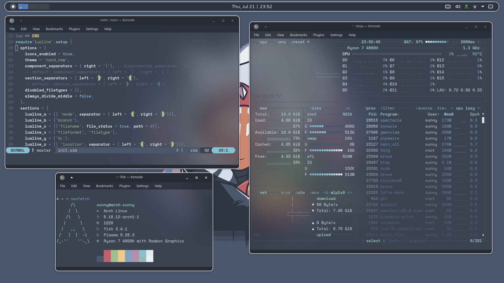

Dotfiles for KDE Plasma, Qtile, and a bunch of other applications I use, all Nord-themed.
Managed with [Dotdrop](https://github.com/deadc0de6/dotdrop). You can ignore `config.yaml` in the root directory if you are not using Dotdrop. 

### Screenshot (KDE)

### Screenshot (Qtile)

*to be added*

### Notes

For line 21 of `init.vim`, since the `nord.nvim` colourscheme has its own Lualine theme, the setting `theme = 'nord'` will set the Lualine theme to the one provided by `nord.nvim` and not Lualine itself. In order to use Lualine's Nord theme, its `nord.lua` file has to be renamed to something else. 

For convenience, copy the provided `nord_new.lua` file to `[your_vim-plug_path]/lualine.nvim/lua/lualine/themes`, and setting `theme = nord_new`. For LunarVim, copy `nord_new.lua` to `~/.local/share/lunarvim/site/pack/packer/start/lualine.nvim/lua/lualine/themes`.

`wallpapers` contain some of the wallpapers I have used. You can 'nordify' any wallpaper with [ImageGoNord](https://ign.schrodinger-hat.it/).

My Qtile config assumes that `rofi-powermenu` and `rofi-audiodevices` are in `$PATH`. Either copy the files to a folder in your `$PATH` or specify the exact paths of the files in the `lazy.spawn` commands.
